# Jsp学习总览

JSP学习笔记为本科期间学习过程中根据官网以及部分教程以及菜鸟文档进行整理，仅供本人在JSP开发过程中的学习记录以及学习过程中的问题总结（末尾小tips内）。

使用的是Tomcat10.1.28，同时也记录了Tomcat8与10的版本代码问题。

jsp就是一种动态网页编程技术，像HTML是静态页面，不能动态从数据库获取数据，但是数据不能全部在页面上写死。

**JSP：**

1. JSP使用
2. Scriptlet脚本小程序
3. JSP的指令标签：include静态包含和动态包含。
4. JSP的四大域对象：page、request、session、application
5. EL表达式的使用

**JSTL：**

1. 标签库的介绍和使用
2. 常用标签
3. if标签
4. choose、when和otherwise标签
5. formatDate标签

本文档参考教程/相关网站：

1. 菜鸟文档：https://www.runoob.com/jsp/jsp-tutorial.html
2. JSTL下载：https://archive.apache.org/dist/jakarta/taglibs/standard/binaries/
3. Tomcat下载：https://tomcat.apache.org/
1. 相关视频教程：https://www.bilibili.com/video/BV1W64y1C7N8?p=11&vd_source=15c40e07ee8855c2a499ddf65f379043

**注：**默认您已经下载：`Eclipse `  或 `IntelliJ IDEA`、 `JDK` 、`Tomcat`

------

# 1 Idea新建项目

新建项目：

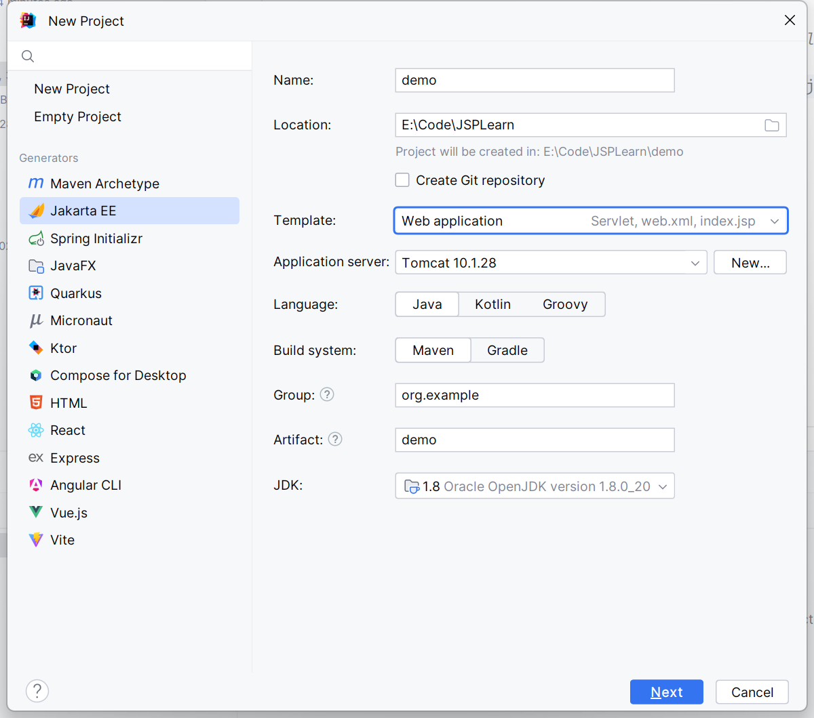

导入Web模块：

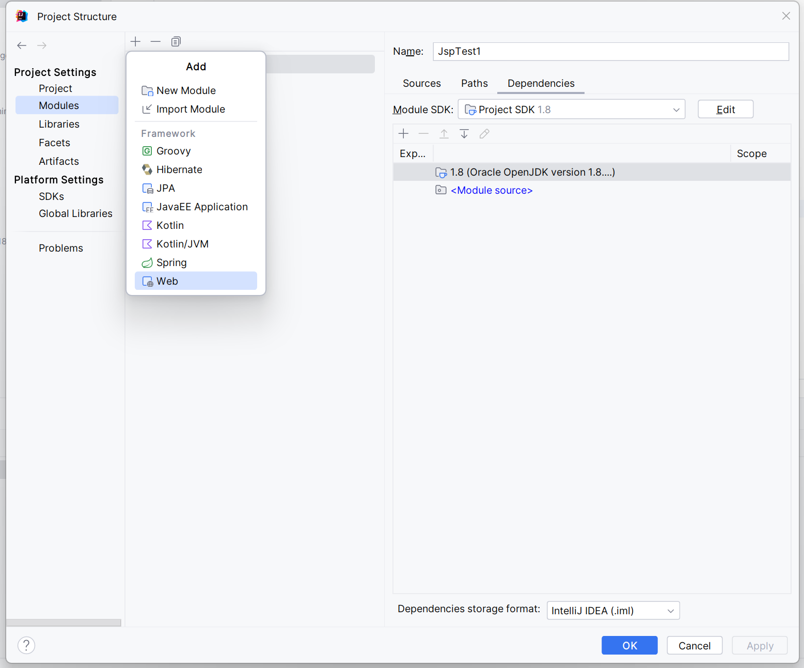

配置Artifact：

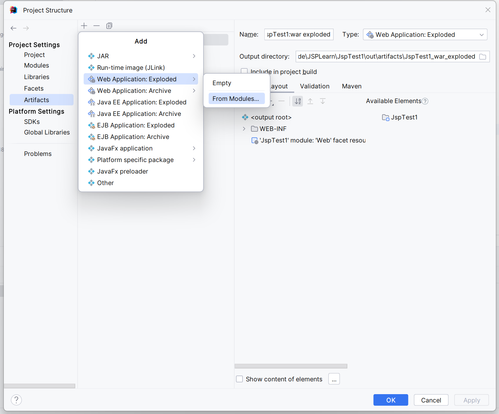

配置Tomcat：

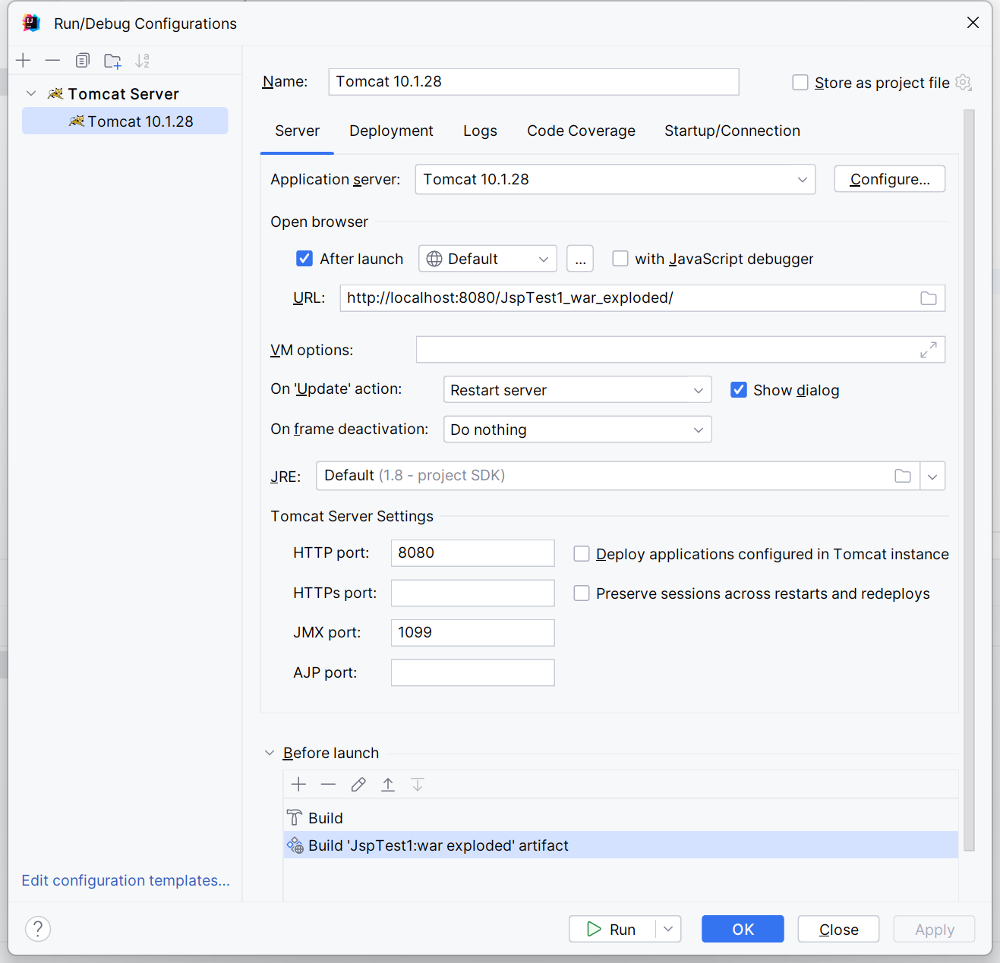

新建jsp文件：

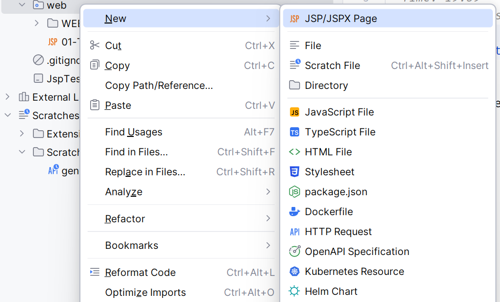

页面报错：

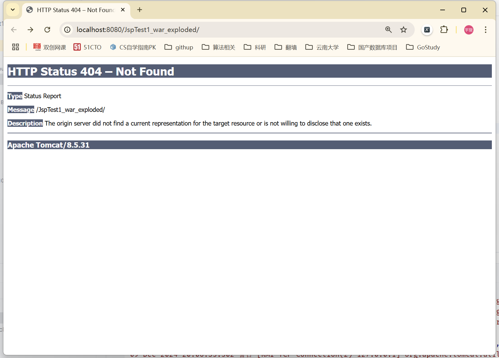

后缀加上你的项目名字：


发现url很奇怪，直接自定义：

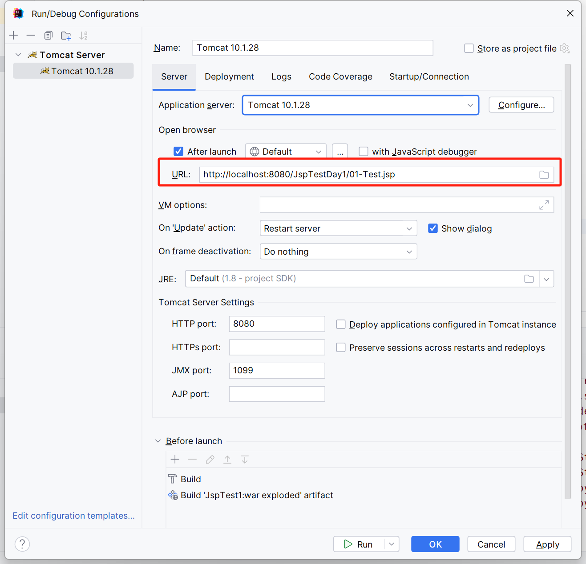

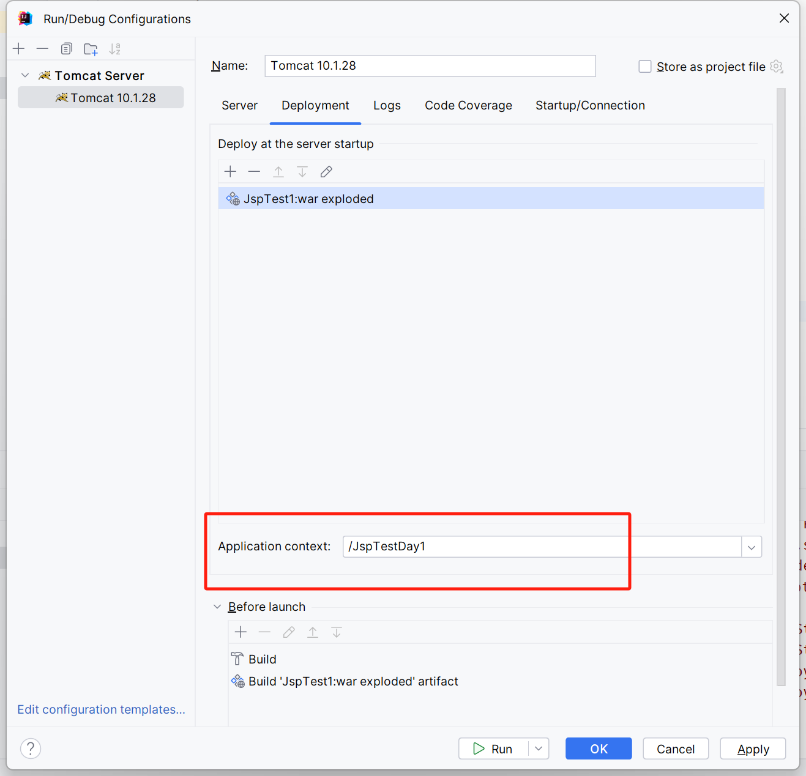

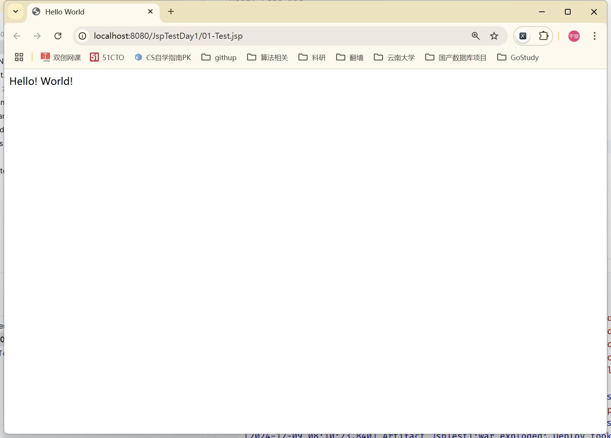

接着会在对应目录下生成class和java文件（用Listary搜JSPTestDay1）：


# 1 Eclipse新建项目


------

# 2 基础语法

## 2.1 注释

```
//单行注释

/*多行注释*/

<!-- HTML风格注释 -->

<%--  JSP注释  --%>
```

```jsp
<%--
  Created by IntelliJ IDEA.
  User: Echo-Nie
  Date: 2024/12/9
  Time: 20:17
  To change this template use File | Settings | File Templates.
--%>
<%@ page contentType="text/html;charset=UTF-8" language="java" %>
<html>
<head>
    <title>JSP基础语法</title>
</head>
<body>
<pre>
    JSP有两种的注释：显示注释和隐式注释
        1. 显示注释：能够在客户端中查看的注释： &lt;!-- HTML 风格注释 --&gt;
        <!--HTML风格注释-->
        2. 隐式注释：不能在客户端看到的注释：
            2.1 <%--JSP自己的注释--%>&lt;%-- JSP自己的注释 --%&gt;
            2.2  JAVA注释:    //单行与多行
<%--  JAVA脚本段  --%>
<%
    //这是单行注释
    /*这是多行注释*/
%>
</pre>

</body>
</html>

```


------

## 2.2 Scrptlet

在JSP中很重要，Scriplet（脚本小程序），所有嵌入在HTML代码中的Java程序。

在JSP中有三种Scriptlet带阿米，必修用Scriptlet标出来。

```
第一种：<%	%>：Java脚本段，可以定义局部变量，编写语句。
第二种：<%!	%>：可以定义全局变量，方法，类。
第三种：<%=	%>：表达式，数据一个变量或者具体内容。
```

```jsp
<%--
  Created by IntelliJ IDEA.
  User: Echo-Nie
  Date: 2024/12/9
  Time: 20:17
  To change this template use File | Settings | File Templates.
--%>
<%@ page contentType="text/html;charset=UTF-8" language="java" %>
<html>
<head>
    <title>Scriptlet</title>
</head>
<body>
<%--第一种：<%	%>：Java脚本段，可以定义局部变量，编写语句。--%>
<%--生成的代码在servlet的service方法体中--%>
<%
    String s = "hello";
//    将s输出到控制台
//    System.out.println(s);
    out.print(s);//将s输出到浏览器
    out.write("---");
    out.print("输出全局变量：num="+num);
    out.write("---");
%>

<%--第二种：<%!	%>：可以定义全局变量，方法，类。--%>
<%--生成的代码在servlet的类体中--%>
<%!
    //声明全局变量
    int num = 0;
    //没有sout
%>

<%--    第三种：<%=	%>：表达式，数据一个变量或者具体内容。    --%>
<%--    生成的代码在servlet的service方法体中，相当于out.print()    --%>
<%= s %>

</body>
</html>
```

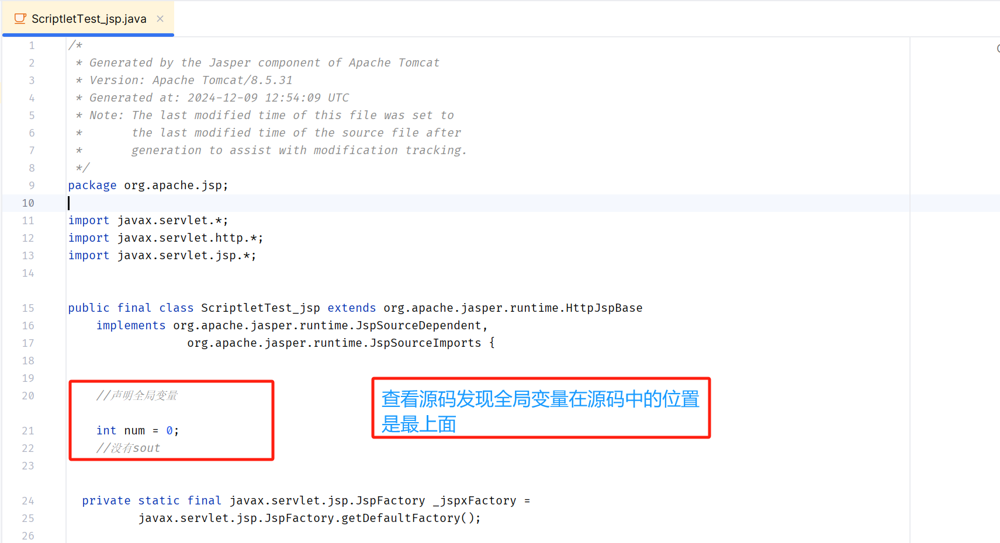


------

## 2.3 JSP的指令标签

使用包含操作，将一些重复的代码包含进来使用，从正常的页面组成来看，有可能分为几个区域，其中有一些区域可能一直不需要改变，改变的就其中一个具体的内容区域。

方法1：每个JSP页面（HTML）都包含工具栏、头部信息、尾部信息、具体内容。

方法2：将工具栏、头部、尾部信息都分成各个独立文件，使用的时候直接导进去。

我们发现第一种方法会有代码重复，修改也不方便，所以在JSP中实现包含操作我们一般是静态包含和动态包含。静态包含使用include就行，动态包含需要使用include动作标签。

好比一个网站，有head和foot，中间是Body，将head和foot封装起来这种感觉。

------

### 2.3.1 静态包含

```jsp
<%@ include file ="url" %>		<!--相对路径 -->
```

静态包含就是将内容进行直接替换，好比程序中定义变量一样，在servlet引擎转译的时候，把这个文件包含进去了（将两个文件的源代码整合到一起，全部放到jspService方法中），所以只生成了一个servlet，所以两个页面不能有同名变量，耦合性高但是不够灵活。

**特点：**

1. 将内容进行直接替换
2. 静态包含只会生成一个源码文件，最终内容均在jspService方法中
3. 因为是一个源码文件，所以不能出现同名变量
4. 运行效率高一点，但是耦合高不灵活

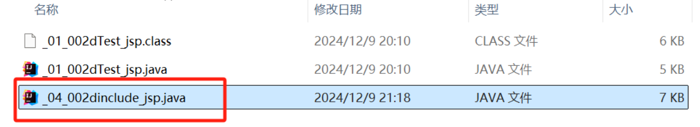

```jsp
<%--
  Created by IntelliJ IDEA.
  User: Echo-Nie
  Date: 2024/12/9
  Time: 21:11
  To change this template use File | Settings | File Templates.
--%>
<%@ page contentType="text/html;charset=UTF-8" language="java" %>
<html>
<head>
    <title>Header头部</title>
</head>
<body>
---------<br>
这是头部<br>
---------<br>
</body>
</html>
```

```jsp
<%--
  Created by IntelliJ IDEA.
  User: Echo-Nie
  Date: 2024/12/9
  Time: 21:10
  To change this template use File | Settings | File Templates.
--%>
<%@ page contentType="text/html;charset=UTF-8" language="java" %>
<html>
<head>
    <title>include</title>
    <%--
        include静态包含：<%@include file="header.jsp" %>
        特点：
        1、将内容进行直接替换
        2、静态包含只会生成一个源码文件，最终内容均在jspService方法中
        3、因为是一个源码文件，所以不能出现同名变量
        4、运行效率高一点，但是耦合高不灵活
    --%>
</head>
<body>
<%@include file="header.jsp" %>
<h2>主体部分</h2>
<%
    int num = 10;
    out.print(num);
%>
<%@include file="footer.jsp" %>
</body>
</html>

```

```jsp
<%--
  Created by IntelliJ IDEA.
  User: Echo-Nie
  Date: 2024/12/9
  Time: 21:11
  To change this template use File | Settings | File Templates.
--%>
<%@ page contentType="text/html;charset=UTF-8" language="java" %>
<html>
<head>
    <title>Footer底部</title>
</head>
<body>
<%
    int num = 11;
%>
-------------<br>
这是尾部<br>
-------------<br>
</body>
</html>
```

------

### 2.3.2 动态包含

动态包含在代码的编译阶段，包含和被包含是两个独立的部分，只有当运行时，才会动态包含进来，有点像java的方法调用。所以会有多个源码文件。

```jsp
<jsp:include page="include.jsp"></jsp:include>
```

**PS：**动态包含中间，也就是include标签之间不要加任何内容（空格也不能加），除非你确定要使用参数。如果有内容它就认为你有参数，就会去找你带参数的标签。

**特点：**

1. 相当于方法的调用
2. 会生成多个源码文件
3. 可以定义同名变量
4. 效率高耦合度低

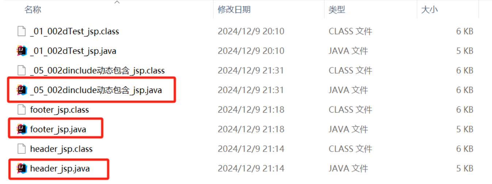

### 2.3.3 动态包含带参数

```jsp
<jsp:param name="str" value="string"/>
<jsp:param name="str" value="<%=str%>"/>
```

name属性不支持表达式，而value支持表达式。

```jsp
<%--
  User: Echo-Nie
  Date: 2024/12/9
  Time: 21:27
  To change this template use File | Settings | File Templates.
--%>
<%@ page contentType="text/html;charset=UTF-8" language="java" %>
<html>
<head>
    <title>include动态包含</title>
</head>
<%--
使用动态包含：
    <jsp:include page="url">
        <jsp:param name="参数名" value="参数值"/>
    </jsp:include>
    注意：name不支持表达式；value支持表达式

    获取参数：
        request.getParameter(name);通过指定参数获取变量名字
--%>
<jsp:include page="header.jsp"></jsp:include>
<h2>主体内容</h2>
<%
    int a = 10;
%>
<jsp:include page="footer.jsp"></jsp:include>
<%--第一次footer的时候，没有传参，所以取到的是null--%>
<%--动态包含传参--%>
<%
    String str = "hello";
%>
<%--第二次footer的时候传参，所以取到的是admin和hello--%>
<jsp:include page="footer.jsp">
    <jsp:param name="uname" value="admin"/>
    <jsp:param name="msg" value="<%=str%>"/>
</jsp:include>

<body>

</body>
</html>
```

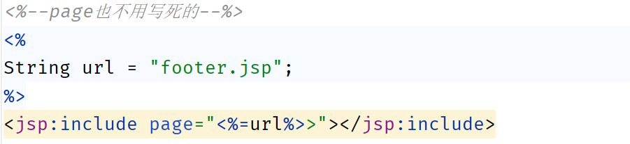


## 2.4 JSP的四大域对象

### 2.4.1 四种属性范围

在JSP中提供了四种属性的保存范围，就是一个设置的对象，可以在多少个页面中保存并使用。

1.page范围

​		pageContext：只在一个页面中保存属性，跳转之后无效。

2.request范围：

​		request：只在一次请求中保存，服务器跳转后依然有效。

3.session范围

​		session：在一次会话范围中，无论何种跳转都可以使用。

4.application范围：

​		application：在整个服务器上保存。

| method                                          | type | description          |
| ----------------------------------------------- | ---- | -------------------- |
| public void setAttributes(String name,Object o) | 普通 | 设置属性的名称及内容 |
| public Object getAttribute(String name)         | 普通 | 根据属性名称取属性   |
| public void removeAttribute(String name)        | 普通 | 删除指定操作         |

### 2.4.2 属性范围特点

**1.page**

本页面取得服务器跳转<jsp :forward>后无效


**2.request**

服务器跳转有效，客户端跳转无效。

如果是客户端跳转，则相当于发生了两次请求，那么第一次的请求将不存在了；如果希望不管是客户端还是服务器跳转，都能保存的话需要扩大范围。


**3.session**

无论客户端还是服务器都可以取得，但是如果重新开新的浏览器，则无法取得之前设置的session，因为每一个session只保存在当前浏览器中，并在相关页面取得。

如果想让属性设置一次之后，不管是否是新的浏览器都可以取得，用application


**4.application**

所有的application属性直接保存在服务器上，所有的用户(每一个session)都可以直接访问取得。

只要是通过application设置的属性，则所有的session都可以取得，表示公共的内容，但是如果此时服务器重启了，则无法取得了，因为关闭服务器后，所有的属性都消失了，所以需要重新设置。

**使用：**在合理的范围内尽可能小。

# 3 login简单页面

## 3.1 loginTest编写

```jsp
<%--
  User: Echo-Nie
  Date: 2024/12/10
  Time: 9:39
  To change this template use File | Settings | File Templates.
--%>
<%@ page contentType="text/html;charset=UTF-8" language="java" %>
<html>
<head>
    <title>Login页面-简易版</title>
</head>
<body>
    
<form action="loginServlet" method="post">
    姓名：<input type="text" name="uname"></br>
    密码：<input type="text" name="upwd"></br>
    <button>登录</button>
    <%--获取后台设置在作用域中的数据并且显示--%>
    <span style="color: dodgerblue;font-size: 12px"><%=request.getAttribute("msg")%></span>
</form>
</body>
</html>
```

## 3.2 LoginServlet编写

```java
package com.ynu.controller;

import jakarta.servlet.ServletException;
import jakarta.servlet.annotation.WebServlet;
import jakarta.servlet.http.HttpServlet;
import jakarta.servlet.http.HttpServletRequest;
import jakarta.servlet.http.HttpServletResponse;
import java.io.IOException;

/**
 * @ClassName LoginService
 * @Description
 * @Author Echo-Nie
 * @Date 2024/12/10 9:46
 * @Version V1.0
 */

@WebServlet("/loginServlet")
public class LoginServlet extends HttpServlet {
    @Override
    protected void service(HttpServletRequest request, HttpServletResponse response) throws ServletException, IOException {
        //设置客户端编码格式
        request.setCharacterEncoding("UTF-8");
        //接收客户端传参
        String uname = request.getParameter("uname");
        String upwd = request.getParameter("upwd");

        //判断传参为空
        if (uname == null || "".equals(uname.trim())) {
            //提示用户信息
            request.setAttribute("msg", "用户姓名不能为空");
            //请求转发跳转到loginTest.jsp
            request.getRequestDispatcher("07-loginTest.jsp").forward(request, response);
            return;
        } else if (upwd == null || "".equals(upwd.trim())) {
            //提示用户信息
            request.setAttribute("msg", "密码不能为空");
            //请求转发跳转到login.jsp
            request.getRequestDispatcher("07-loginTest.jsp").forward(request, response);
            return;
        }

        //判断账号密码是否正确
        if(!"nyx".equals(uname)){
            //提示用户名错误
            request.setAttribute("msg","用户名错误，登录失败");
            request.getRequestDispatcher("07-loginTest.jsp").forward(request, response);
            return;
        }
        //判断密码
        if(!"nyx".equals(upwd)){
            request.setAttribute("msg","密码错误，登录失败");
            request.getRequestDispatcher("07-loginTest.jsp").forward(request, response);
            return;
        }
        //登录成功
        //设置登录时的信息到session作用域
        request.getSession().setAttribute("uname",uname);
        //跳转到登录页面
        response.sendRedirect("07-index.jsp");

    }
}
```

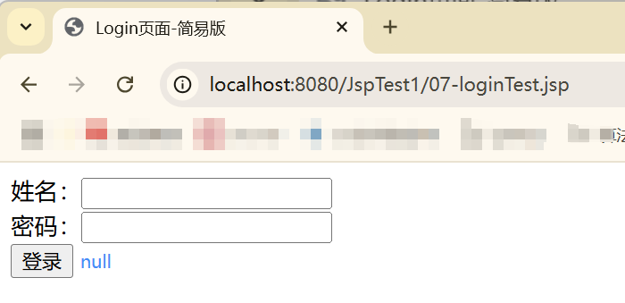


# 4 EL表达式

## 4.1 EL基本语法

首先发现上面提示信息那一块是null，影响美观，能不能换成空串？引出EL表达式。

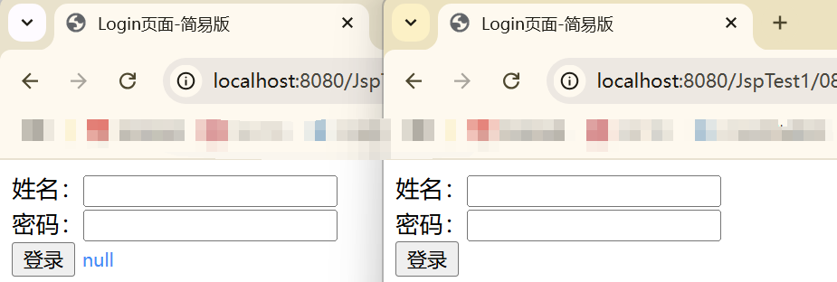

EL(Expression Language)是为了使JSP 写起来更加简单。表达式语言的灵感来自于ECMAScript 和XPath 表达式语言，它提供了在JSP 中简化表达式的方法，让Jsp 的代码更加简化。

```jsp
语法结构：${expression}
```

EL表达式操作的一般是==域中的数据==，操作不了局部变量。

域对象的概念在JSP 中一共有四个:**pageContext、request、session、application；**范围依次是：

本页面

一次请求

一次会话

整个应用程序。

当需要指定从某个特定的域对象中查找数据时可以使用四个域对象对应的空间对象，分是：pageScope，requestScope，sessionScope，applicationScope。

EL 默认的查找方式为从小到大查找，找到即可。当域对象全找完了还未找到则返回空字符串""。

```jsp
<%--
  User: Echo-Nie
  Date: 2024/12/10
  Time: 16:11
  To change this template use File | Settings | File Templates.
  Description：
  EL表达式
    作用:简化JSP代码
    格式:
        ${域对象的名称}
    操作对象:
        EL表达式一般操作的是域对象，不能操作局部变量。
    操作范围:
        page范围在当前页面
        request范围在一次请求
        session范围在一次会话
        application范围在整个应用程序
     可通过pageScope、
     PS：如果EL表达式获取的域对象值为空，默认是空串；
     EL表达式默认从小到大的范围去找，找到即可，如果四个范围都没找到，显示空字符串。
--%>
<%@ page contentType="text/html;charset=UTF-8" language="java" %>
<html>
<head>
    <title>EL表达式</title>
</head>
<body>
<%--设置数据--%>
<%
    pageContext.setAttribute("uname", "zs");
    request.setAttribute("uname", "ls");
    session.setAttribute("uname", "ww");
    application.setAttribute("uname", "zl");

//    局部变量
    String str = "hello";
%>
<%--获取数据--%>
获取局部变量：${str} </br>
获取域对象：${uname}<br>

<%--
输出如下：
获取局部变量：
获取域对象：zs
--%>

<%--获取指定域的数据--%>
<br>获取指定域的数据：<br>
&nbsp;&nbsp;page域数据：${pageScope.uname}<br>
&nbsp;&nbsp;request域数据：${requestScope.uname}<br>
&nbsp;&nbsp;session域数据：${sessionScope.uname}<br>
&nbsp;&nbsp;application域数据：${applicationScope.uname}<br>
</body>
</html>
```

## 4.2 EL获取数据

**<font size=4>设置域对象中的数据</font>**

```jsp
<%
    /*page*/
//    本页面取得服务器跳转<jsp :forward>后无效
    pageContext.setAttribute("uname","zs");

    /*request*/
//    服务器跳转有效，客户端跳转无效。
    request.setAttribute("uname","ls");

    /*session*/
//    如果重新开新的浏览器，则无法取得之前设置的session
    session.setAttribute("uname","ww");

    /*application*/
//    服务器重启了，则无法取得了
    application.setAttribute("uname","lmz");
%>
```

**<font size=4>获取域对象的值</font>**

```jsp
${uname}	<!-- 输出结果为:zs -->
```

**<font size=4>获取指定域对象的值</font>**

```jsp
<%--获取指定域的数据--%>
<br>获取指定域的数据：<br>
&nbsp;&nbsp;page域数据：${pageScope.uname}<br>
&nbsp;&nbsp;request域数据：${requestScope.uname}<br>
&nbsp;&nbsp;session域数据：${sessionScope.uname}<br>
&nbsp;&nbsp;application域数据：${applicationScope.uname}<br>
```

**<font size=4>获取List</font>**

```jsp
<%
	//List
    List<String> list = new ArrayList<>();
    list.add("aaa");
    list.add("bbb");
    list.add("ccc");
    request.setAttribute("list", list);
%>
<h4>获取List</h4>
获取list的size：${list.size()};<br>
获取list的指定下标值list[1]：${list[1]}<br>
```

**<font size=4>获取Map</font>**

```jsp
<%
    //Map
    Map map = new HashMap<>();
    map.put("aaa", "111");
    map.put("bbb", 111);
    map.put("ccc", 33);
    request.setAttribute("map", map);
%>
<h4>获取Map</h4>
获取map指定的key的value：${map.aaa} 或者 ${map["bbb"]};
```

**<font size=4>获取JAVABean</font>**

```jsp
<%
    //JavaBean
    User user = new User(1, "nyx", "123");
    request.setAttribute("user", user);
%>
<h4>获取JAVABean</h4>
${user}<br>
获取JAVABean中属性：uname=${user.uname}或者getUname=${user.getUname()}
<%--
输出如下：
com.ynu.po.User@62adb472
获取JAVABean中属性：uname=nyx或者getUname=nyx
--%>
```

## 4.3 Empty与一些运算

```jsp
<%@ page import="java.util.List" %>
<%@ page import="java.util.ArrayList" %>
<%@ page import="java.util.Map" %>
<%@ page import="java.util.HashMap" %>
<%@ page import="com.ynu.po.User" %><%--
  User: Echo-Nie
  Date: 2024/12/11
  Time: 23:35
  To change this template use File | Settings | File Templates.
--%>
<%@ page contentType="text/html;charset=UTF-8" language="java" %>
<html>
<head>
    <title>10-empty与EL运算.jsp</title>
    <%--
        empty
            判断域对象是否为空，为空返回true，否则为false
                ${empty 限域变量名}
            判断对象是否不为空
                ${!empty 限域变量名}
         对于字符串：
            不存在返回true
            有值返回false
            空串true
            null也是true

          对于List：
            null返回true
            没有长度size的也返回true

          对于Map：
            null返回true
            空Map对象返回true

          对于JAVABean：
             null返回true
             空对象返回false
    --%>

</head>
<body>
<%
    //字符串
    request.setAttribute("str1", "abc");
    request.setAttribute("str2", "");
    request.setAttribute("str3", null);
    //List
    List list1 = new ArrayList<>();
    List list2 = null;
    List list3 = new ArrayList<>();
    list3.add(1);
    request.setAttribute("list1", list1);
    request.setAttribute("list2", list2);
    request.setAttribute("list3", list3);

    //Map
    Map map = new HashMap<>();
    Map map1 = null;
    Map map2 = new HashMap<>();
    map2.put(1, 2);
    request.setAttribute("map", map);
    request.setAttribute("map1", map1);
    request.setAttribute("map2", map2);

    //JAVABean
    User user = null;
    User user1 = new User();
    User user2 = new User(1, "nyx", "123");
    request.setAttribute("user", user);
    request.setAttribute("user1", user1);
    request.setAttribute("user2", user2);
%>
<h4>判断字符串是否不存在</h4>
${empty str}返回true<br>
${empty str1}返回false<br>
${empty str2}返回true<br>
${empty str3}返回true<br>
<br>

<h4>判断List是否为空</h4>
${empty list1}返回true<br>
${empty list2}返回true<br>
${empty list3}返回false<br>

<h4>判断Map是否为空</h4>
${empty map}返回true<br>
${empty map1}返回true<br>
${empty map2}返回false<br>

<h4>判断JAVABean</h4>
${empty user}返回true<br>
${empty user1}返回false<br>
${empty user2}返回false<br>
-----------------------比较两个值是否相等，==或eq----------------
<%
    request.setAttribute("a", 10);
    request.setAttribute("b", 2);
    request.setAttribute("c", "aa");
    request.setAttribute("d", "bb");
%>
${a==b}
${c==d}
${c eq d}
${a ==5}
${c =="aa"}

<br>
</body>
</html>
```

# 5 JSTL

## 5.1 标签使用

Java Server Pages Standard Tag Libray(STL):JSP 标准标签库。

是一个定制标签类库的集合，用于解决一些常见的问题，例如迭代一个映射或者集合、条件测试、XML处理，甚至数据库和访问数据库操作等。

核心标签库：包含web常见工作，如循环、表达式赋值、基本输入输出等。

格式化标签库：用来格式化显示数据的工作，比如：对不同区域的日期格式化。

要在JSP中使用JSTL类库，必须使用下面的taglib指令：

```jsp
<%@taglib uri="" prefix="" %>
如：
<%@taglib uri="http://java.sun.com/jsp/jstl/cire" prefix="c" %>
```

前缀可以是任意内容，遵循规范形成相同的码风会比较好，使用实现设计好的前缀即可。

在官网(https://archive.apache.org/dist/jakarta/taglibs/standard/binaries/)下载好Jakarta-taglib-standard-1.1.2.zip解压后将lib下的两个jar包拷贝到指定目录下

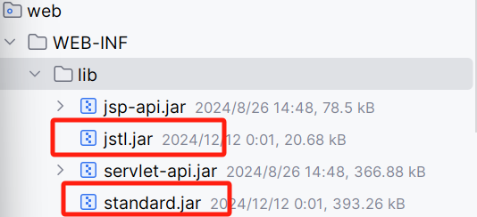


## 5.2 条件动作标签

条件动作指令用于处理页面的输出结果依赖于某些输入值的情况，在lava 中是利用 if、 if..else 和 switch 语句来进行处理的。在JSTL中也有4个标签可以执行条件式动作指令:if、choose、when和otherwise。

<font size="5">**if标签**</font>

if它的主体内容，测试结果保存在一个Boolean 对象中，并创建一个限域变量来引用 Boolean 对象。可以利用 var 属性设置限域变量名，利用 scope 属性来指定其作用范围。

```jsp
<c:if test="<boolean>" var="<string>" scope="<string>">

...

</c:if>
```

```jsp
<html>
<head>
    <title>JSTL的使用</title>
    <%--
        首先拷贝两个jar包到web-INF的lib目录下；再导入jst和standard的jar包到项目中
    --%>
</head>
<body>
<c:if test="${1==1}">
    Hello JSTL
</c:if>
<%
    request.setAttribute("num", 10);
    request.setAttribute("num1", 10);
%>


<c:if test="${num>0}">
    数据大于0
</c:if>

<br>
<c:if test="${num>100}" var="flag" scope="request"></c:if>
${flag}--${pageScope.flag}${requestScope.flag}--${sessionScope.flag}

<c:if test="${num1>20}" var="flag1" scope="request"></c:if>
${flag1}--${requestScope.flag1}--${sessionScope.flag1}
<%--    false--false--  --%>
<%--
    test条件判断，操作的是域对象，接受返回结果是boolean类型的值
    var是限域对象，存放在作用域中的变量名，用来接受判断结果的值
    scope是限域变量名的范围，page-request-session-application
--%>
</body>
</html>
```

| 属性  |                    描述                     | 是否必要 | 默认值 |
| :---: | :-----------------------------------------: | :------: | :----: |
| test  |                    条件                     |    是    |   无   |
|  var  |    用于存储条件结果的变量（限域变量名）     |    否    |   无   |
| scope | 可取值：page\|request\|session\|application |    否    |  page  |


<font size="5">**choose-when-otherwise标签**</font>

相当于就是switch-case；choose 和 when 标签的作用与lava 中的 switch 和 case 关键字相似，用于在众多选项中做出选择。也就是说:他们为相互排斥的条件式执行提供相关内容。

switch语句中有case，而choose标签中对应有when，switch语句中有default，而choose标签中有otherwise.

```jsp
<c:choose>
	<c:when test="<boolean>">

	...

	</c:when>
	<c:when test="<boolean>">
	
	...
	
	</c:when>
	
	...
	
	<c:otherwise>
		...
	</c:otherwise>
</c:choose>
```

## 5.3 迭代标签

forEach 是将一个主体内容迭代多次，或者迭代一个对象集合。可以迭代的对象包括所有的java.util.Collection 和java.util.Map 接口的实现，以及对象或者基本类型的数组。

还可 以迭代java.util.lterator 和 java.util.Enumeration,但不能在多个动作指令中使用 lterator 或者 Enumeration,因为lterator 或者 Enumeration都不能重置(reset)。各属性含义如下:

| 属性  |                    描述                    | 是否必要 |   默认值    |
| :---: | :----------------------------------------: | :------: | :---------: |
| items |               要被循环的数据               |    否    |     无      |
| begin |  开始的元素（0=第一个元素，1=第二个元素）  |    否    |      0      |
|  end  | 最后一个元素（0=第一个元素，1=第二个元素） |    否    | Lastelement |

```jsp
<c:forEach
    items="<object>"
    begin="<int>"
    end="<int>"
    step="<int>"
    var="<string>
    varstatus="<string>"
</c:forEach>
```

```jsp
<!-- 遍历主体内容多次 -->

<c:forEach begin="0" end="10" var="i">
    标题 $ti<br>
</c:forEach>

<!-- 循环 -->
<%
List<String> list = new ArrayList<String>();

for (int i = 1; i <= 10; i++) {
    list.add("A:" + i);
}

pageContext.setAttribute("li", list);
%>

<!-- 循环集合 -->

<c:forEach items="${1i}" var="item">
    ${item}
</c:forEach>

<hr>

<table align="center" width="800" border="1" style="border-collapse: collapse;">
    <tr>
        <th>名称</th>
        <th>当前成员下标</th>
        <th>当前成员循环数</th>
        <th>是否第一次被循环</th>
        <th>是否最后一次被循环</th>
    </tr>
    <c:forEach items="${1i}" var="item" varStatus="itemp">
        <tr>
            <td>${item}</td>
            <td>${itemp.index}</td>
            <td>${itemp.count}</td>
            <td>${itemp.first}</td>
            <td>${itemp.last}</td>
        </tr>
    </c:forEach>
</table>

<!-- 遍历Map -->

<%
Map<String, Object> map = new HashMap<String, Object>();
map.put("map1", "aaa");
map.put("map2", "bbb");
map.put("map3", "ccc");
pageContext.setAttribute("map", map);
%>

<c:forEach items="${map}" var="mymap">
    键：${mymap.key} -- 值：${mymap.value} <br>
</c:forEach>
```


## 5.4 格式化动作标签（偏）

JSTL提供了格式化和解析数字和日期的标签,我们讨论里面有:formatNumber、formatDate、parseNumber及parseDate.

### 5.4.1 formatNumber

用于格式化数字，百分比，货币。该标签用指定的格式或精度来格式化数字，将数值型数据转换成指定格式的字符串类型。语法模板如下：

```jsp
<fmt :formatNumber
value="<string>"
type="<string>"
var="<string>"
scope="<string>"/>
```

| 属性  |              描述               | 是否必要 |    默认值     |
| :---: | :-----------------------------: | :------: | :-----------: |
| value |          要显示的数字           |  **是**  |      无       |
| type  | number,currency, 或 percent类型 |    否    |    Number     |
|  var  |      存储格式化数字的变量       |    否    | Print to page |
| scope |         var属性的作用域         |    否    |     page      |

```jsp
<fmt:formatNumber value="10" type="currency" var="num"/> ${num} <br>
<fmt:formatNumber value="10" type="percent" /><br>
<fmt:formatNumber value="10" type="currency" /><br>
<%--设置时区--%>
<fmt:setLocale value="en_US"/>
<fmt:formatNumber value="10" type="currency"/>
```

### 5.4.2 formatDate

标签用于使用不同的方式格式化日期。将Rate型数据转换成指定格式的字符串类型。

|   属性    |                 描述                  | 是否必要 |  默认值  |
| :-------: | :-----------------------------------: | :------: | :------: |
|   value   |             要显示的日期              |    是    |    无    |
|   type    |          DATE, TIME, 或 BOTH          |    否    |   date   |
| dateStyle | FULL, LONG, MEDIUM, SHORT, 或 DEFAULT |    否    | default  |
| timeStyle | FULL, LONG, MEDIUM, SHORT, 或 DEFAULT |    否    | default  |
|  pattern  |            自定义格式模式             |    否    |    无    |
| timeZone  |            显示日期的时区             |    否    | 默认时区 |
|    var    |        存储格式化日期的变量名         |    否    |   页面   |
|   scope   |       存储格式化日志变量的范围        |    否    |   页面   |

| 代码 |                    描述                    |    实例    |
| :--: | :----------------------------------------: | :--------: |
|  y   |    年份小于10，显示不具有前导零的年份。    |    2002    |
|  M   |     月份数字。一位数的月份没有前导零。     | April & 04 |
|  d   |   月中的某一天。一位数的日期没有前导零。   |     20     |
|  h   | 12小时制的小时。一位数的小时数没有前导零。 |     12     |
|  H   | 24小时制的小时。一位数的小时数没有前导零。 |     0      |
|  m   |      分钟。一位数的分钟数没有前导零。      |     45     |
|  s   |        秒。一位数的秒数没有前导零。        |     52     |

```jsp
<%--格式化日期--%>
<%
    request.setAttribute("myDate",new Date());
%>
${myDate} <br>
<fmt:formatDate value="${myDate}"/> <br>
<fmt:formatDate value="${myDate}" type="date"/> <br>
<fmt:formatDate value="${myDate}" type="time"/> <br>
<fmt:formatDate value="${myDate}" type="both"/> <br>
<fmt:formatDate value="${myDate}" type="both"/> <br>
<fmt:formatDate value="${myDate}" type="both" dateStyle="FULL"/> <br>
<fmt:formatDate value="${myDate}" type="both" dateStyle="short"/> <br>
<fmt:formatDate value="${myDate}" pattern="yyyy-MM-dd"/> <br>
```


### 5.4.3 parseNumber与Date

parseNumber标签用来解析数字，百分数，货币。将数字、货币或百分比类型的字符串转换成数值型。

```jsp
<fmt:parseNumber
	value="<string>"
	type="<string"
	var="<string>"
	scope="<string>"/>
```

| 属性  | 描述                         | 是否必要 | 默认值        |
| ----- | ---------------------------- | -------- | ------------- |
| value | 要解析的数字                 | 否       | Body          |
| type  | NUMBER, CURRENCY, 或 PERCENT | 否       | number        |
| var   | 存储待解析数字的变量         | 否       | Print to page |
| scope | var属性的作用域              | 否       | page          |

```jsp
<%--parseNumber的使用--%>
<%--<fmt:setLocale value="zh_CN"/>--%>
<%--转换回中国时区，就可以用￥--%>
<fmt:parseNumber value="100"/><br>
<fmt:parseNumber value="100" type="number"/><br>
<fmt:parseNumber value="100%" type="percent"/><br>
<fmt:parseNumber value="$10.00" type="currency"/><br>
<%--因为前面设置了US时区，这里不能用“￥”，会报错，必须用对应时区的货币标识符才可以--%>
```

parseDate：解析日期，把指定格式的字符串转成日期。

```jsp
<fmt:parseDate value="2024-12-11" type="date"/><br>
<fmt:parseDate value="2024/12/11" pattern="yyyy/MM/dd"/><br> 
```


# 6 JSP实现Login


------

# 一些小问题

## 1 发现使用“out”报错

在tomcat下找到下面两个jar包，放到lib下面。

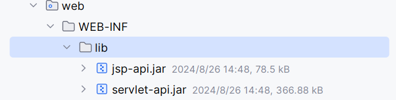

接着，右键，add as Library

最后得到下图所示即可解决问题。

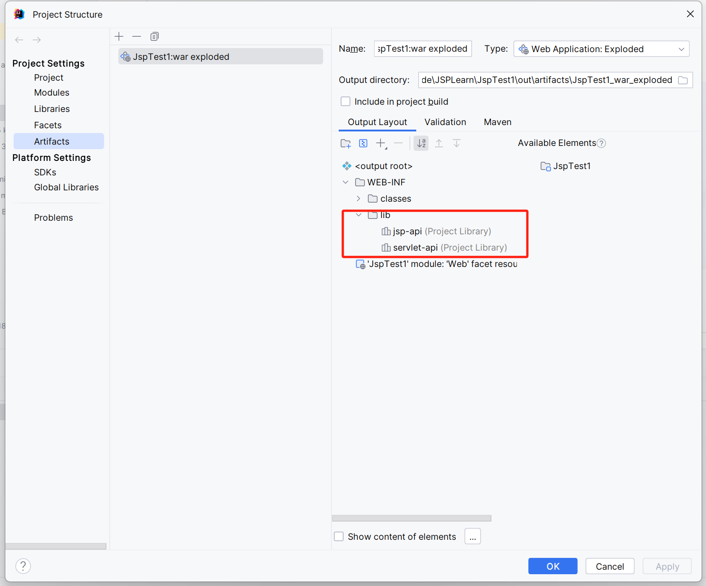

## 2 静态include的变量重复定义

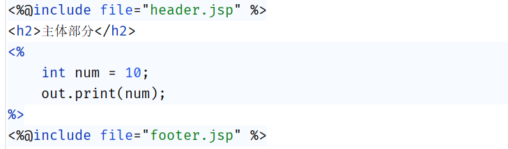

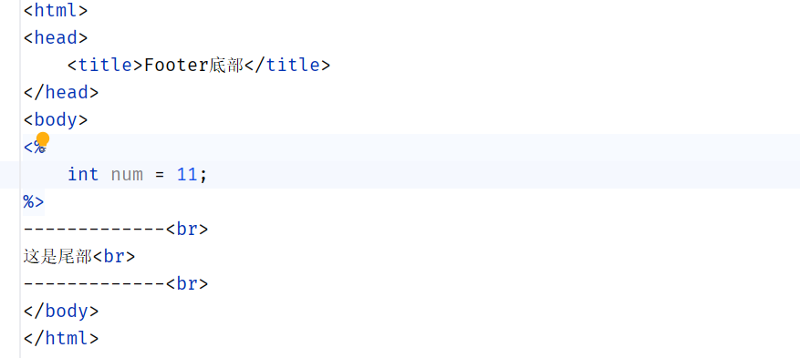

如果你在主体中有变量num，然后在foot或者head中也有同名变量，将会报如下错误。

```jsp
An error occurred at line: [15] in the jsp file: [/footer.jsp]
Duplicate local variable num
```


## 3 一个超蠢版本问题（2024.11.09更）

在写简单的登录页面demo的过程中发生了一个404问题。

```html
HTTP Status 404 – Not Found
Type Status Report

Message /JSPTest1/loginServlet

Description The origin server did not find a current representation for the target resource or is not willing to disclose that one exists.

Apache Tomcat/8.5.31
```

这里是因为是用的8.5，JavaEE被Oracle捐献给Apache了。目前JavaEE的最高版本是 JavaEE8；Apache把JavaEE换名了，以后不叫JavaEE了，以后叫做 jakarta EE。所以JavaEE8版本升级之后叫做JakartaEE9

JavaEE8的时候对应的Servlet类名是：javax.servlet

JakartaEE9的时候对应的Servlet类名是：jakarta.servlet

在Tomcat9之前是javax，Tomcat9之后是Jakarta。如果不替换Tomcat版本将出现以下问题：

```html
javax.servlet.ServletException: Class [LoginServlet] is not a Servlet
	org.apache.catalina.authenticator.AuthenticatorBase.invoke(AuthenticatorBase.java:496)
	org.apache.catalina.valves.ErrorReportValve.invoke(ErrorReportValve.java:81)
	org.apache.catalina.valves.AbstractAccessLogValve.invoke(AbstractAccessLogValve.java:650)
	org.apache.catalina.connector.CoyoteAdapter.service(CoyoteAdapter.java:342)
	org.apache.coyote.http11.Http11Processor.service(Http11Processor.java:803)
	org.apache.coyote.AbstractProcessorLight.process(AbstractProcessorLight.java:66)
	org.apache.coyote.AbstractProtocol$ConnectionHandler.process(AbstractProtocol.java:790)
	org.apache.tomcat.util.net.NioEndpoint$SocketProcessor.doRun(NioEndpoint.java:1468)
	org.apache.tomcat.util.net.SocketProcessorBase.run(SocketProcessorBase.java:49)
	java.base/java.util.concurrent.ThreadPoolExecutor.runWorker(ThreadPoolExecutor.java:1144)
	java.base/java.util.concurrent.ThreadPoolExecutor$Worker.run(ThreadPoolExecutor.java:642)
	org.apache.tomcat.util.threads.TaskThread$WrappingRunnable.run(TaskThread.java:61)
	java.base/java.lang.Thread.run(Thread.java:1623)
```

所以最好的办法就是下个**Tomcat9之后**的版本然后配置一下就没问题了，很蠢的问题，花了我十多分钟。。。。。记录一下自己的傻逼时刻。

补充：可以使用

```jsp
@WebServlet("/loginServlet")
```

也可以在web.xml中配置：

```jsp
    <servlet>
        <servlet-name>LoginServlet</servlet-name>
        <servlet-class>LoginServlet</servlet-class>
    </servlet>
    <servlet-mapping>
        <servlet-name>LoginServlet</servlet-name>
        <url-pattern>/loginServlet</url-pattern>
    </servlet-mapping>
```

## 4 JSTL导包问题

如果使用Tomcat8的话，直接去官网下载前面的版本即可。但是

如果使用的是Tomcat10的话，不要下载1.1.2了，要用以下两个包（Jakarta的，官网那个是javax的。直接点击下面两个网址就能下载）：

https://repo.maven.apache.org/maven2/jakarta/servlet/jsp/jstl/jakarta.servlet.jsp.jstl-api/2.0.0/jakarta.servlet.jsp.jstl-api-2.0.0.jar

https://repo.maven.apache.org/maven2/org/glassfish/web/jakarta.servlet.jsp.jstl/2.0.0/jakarta.servlet.jsp.jstl-2.0.0.jar

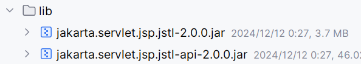


## 5 项目重命名问题

一个很简单的问题，大部分人也不会犯，但是我手贱试了一下，报错的时候还是有点慌的...

如果把项目重命名，如下：

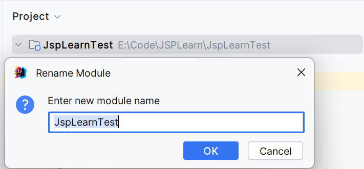

会导致404，原因很简单，假设原项目是JspLearn，被你改成了JspLearnTest，那么原本你的web项目的路径都是原来的，比如说是xxx/xxx/JspLearn路径下，但是你在xxx/xxx/JspLearnTest路径下会找不到，很合理。这个时候只需要把web重新配置即可，如下图：


把Artifacts重新创建，在Module里面重新添加web配置，最后把tomcat原来的Development和Server重新添加即可。
