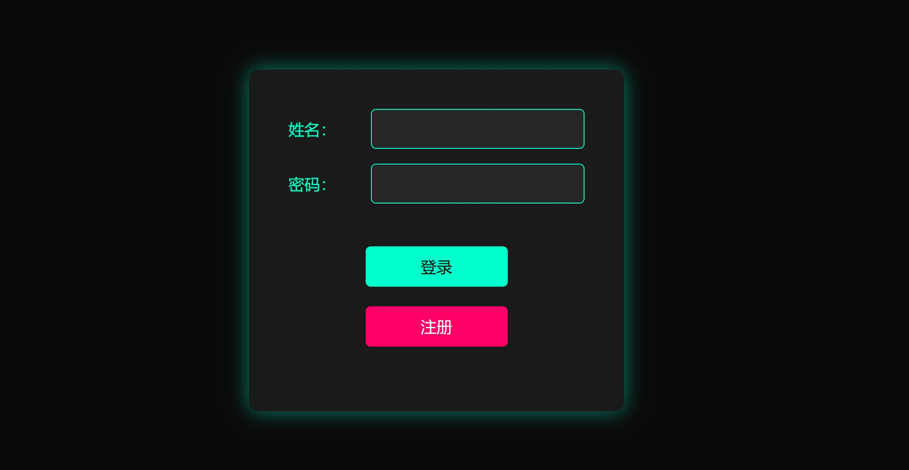
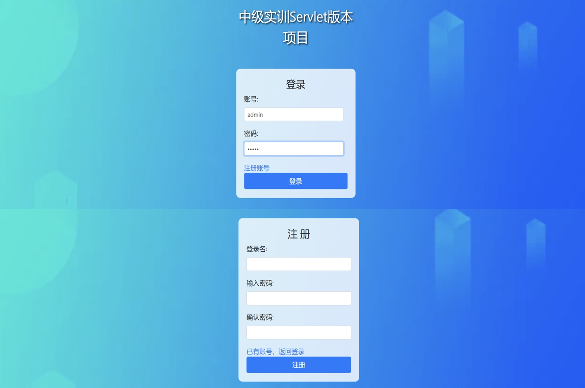
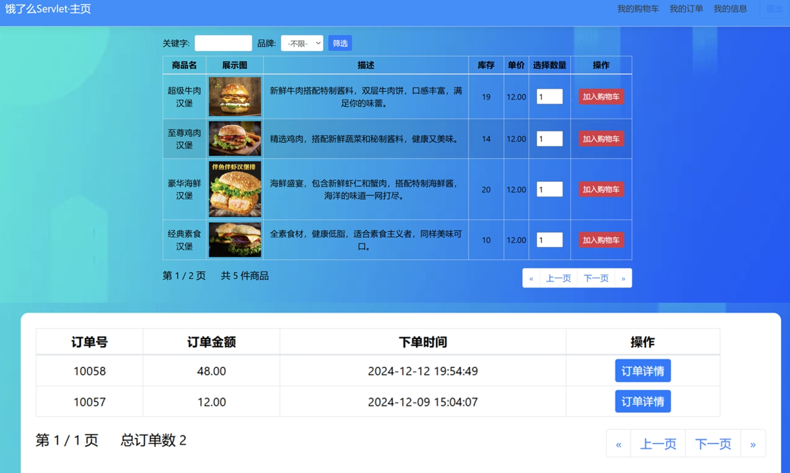

# JSPLearn（停止更新）
记录在本科期间学习JSP时候的技术总结以及遇到的问题，目前不再维护😢


## 手搓Login

```bash
Login项目包结构：
com.ynu.edu/
├── controller/
│   ├── LogoutServlet.java
│   └── UserServlet.java
│
├── entity/
│   └── User.java
│
├── mapper/
│   └── UserMapper.java
│
├── service/
│   └── UserService.java
│
├── util/
│   ├── GetSqlSession.java
│   └── StringUtil.java
│
├── vo/
│   └── MessageModel.java
│
├── resources/
│   ├── com.ynu.edu.mapper/
│   │   ├── UserMapper.xml
│   │   └── mybatis-config.xml
│   └── mysql.properties
│
├── webapp/
│   ├── css/
│   ├── js/
│   │   └── jquery-3.4.1.js
│   ├── WEB-INF/
│   │   ├── lib/
│   │   ├── web.xml
│   │   └── index.jsp
│   ├── login.jsp
│   └── M+ 编写逻辑.md
│
└── test/
    ├── java/
    │   └── TestSession.java
    └── resources/
```



## Elm-JSP Project Overview

本项目是于本科期间的实训课提到JSP技术而完成的外卖点单平台，采用JSP前后端不分离技术。

**ps：**由于JSP较难维护，所以本项目将不再更新与改进，仅供后续个人的学习回顾及相关技术的复习。

```bash
ElmJSP
│  └── src                   
│      └── com.ynu.edu       
│          ├── bean          # 存放 JavaBean 类，封装数据
│          ├── dao           # 数据访问对象，数据库操作
│          ├── filter        # Servlet 过滤器，用于请求和响应的预处理
│          ├── page          # 页面与查询
│          ├── servlet       # Servlet 类，处理 HTTP 请求
│          ├── cart          # 购物逻辑
│          ├── order         # 订单逻辑
│          ├── product       # 产品逻辑
│          ├── user          # 用户逻辑
│          ├── util          # 工具类
│          └── vo            # 值对象
├── web                       # Web 相关资源或配置
├── WebContent                # 根目录，前端资源
│   ├── backend               
│   ├── common                # 公共资源，共享的 JSP 文件
│   ├── css                   
│   ├── images                
│   ├── js                    
│   ├── META-INF              
│   ├── portal                # 门户、前台页面相关
│   └── WEB-INF               
|
│   ├── index.jsp             # 首页
│   ├── login.jsp             # 登录页面
│   └── register.jsp          # 注册页面
```





